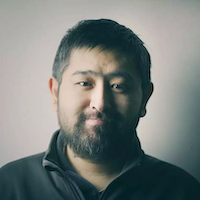
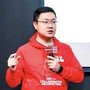

# 领域驱动设计练功房（DDD Dojo）

## Slogan

> **实战召唤，码上行动！**

## 太长不读版介绍

> **4天2段式线下讲解 + 实操，带你从 TDD 走向 DDD。**

## 内容介绍

（待补充）

### 一段：DDD协作设计练功房（2天）

> **以统一语言为“道”，以协作设计为“法”，道法自然，实践领域驱动设计。**

#### 学习内容

- **DDD相关概念讲解：**核心概念 / 适用场景 / 实战经验和案例
- **DDD分段式设计之战略设计：**业务抽象 / 概念分界 / 问题域划分
- **DDD分段式设计之战术设计：**领域建模 / 模块拆分

#### 课程安排

（待补充）

### 二段：DDD分层架构练功房（2天）

> **以整洁架构为“形”，以测试驱动为“神”，形神合一，驱动设计成果落地。**

#### 学习内容

- **测试驱动：**自动化测试概念 / 测试替身 / 测试驱动开发
- **分层架构：**整洁架构思想 / 测试驱动的分层架构落地

#### 课程安排

（待补充）

## 讲师介绍

### 仝键

**ThoughtWorks 企业大学联合创始人 / 首席技术顾问 / 首席培训师 / 全栈工程师**

14年软件开发⼯作经验。曾担任过架构师、业务分析师、项⽬经理、产品经理、部⻔负责⼈。在敏捷软件开发过程，软件设计，系统架构，⼤规模遗留系统重构、企业内部创新创业⽅⾯有丰富的经验。近年来主要关注在如何快速、⼤规模培养优秀的数字化⼈才。曾负责公司内能⼒建设体系的规划，现在专注于帮助更多企业解决数字化时代的⼈才能⼒问题。

### 胡皓

**ThoughtWorks 企业大学联合创始人 / 首席技术顾问 / 首席培训师 / 全栈工程师**

12年软件开发工作经验。从士兵成长起来的软件技术顾问，从事过广泛的业务分析，项目管理，全栈软件开发、培训和技术咨询等工作。当前，作为ThoughtWorks中国区咨询BU数字化架构能力团队的负责人，正深耕于以演进式架构、领域驱动设计、云原生微服务为代表的数字化架构能力，帮助客户实现软件工程能力提升和数字化转型的目标。

## 开课时间

- 第一期
  - 地点：西安
  - DDD 协作设计练功房（2020年3月14日——2020年3月15日，2天）
  - DDD 分层架构练功房（2020年3月21日——2020年3月22日，2天）
- 第二期
  - 地点：*待定*
  - 2020年第二季度
- 第三期
  - 地点：*待定*
  - 2020年第三季度
- 第四期
  - 地点：*待定*
  - 2020年第四季度

# License

Copyright © 2020 ThoughtWorks, Inc. and Contributors.

This work is licensed under a [Creative Commons Attribution-NonCommercial-NoDerivatives 4.0 International](https://creativecommons.org/licenses/by-nc-nd/4.0/).
